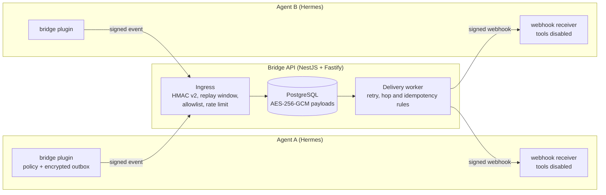

# Hermes Agent Bridge

A signed, observable event bridge that lets two autonomous Hermes agent instances exchange messages over HTTP when a chat platform cannot carry agent-to-agent traffic.

## Why I built it

I ran two AI agents in a shared Telegram group and found out that the Telegram Bot API never delivers a bot's message to other bots, so the agents could not talk to each other (Privacy Mode and admin rights do not change this). The workaround of relaying through a human is not reliable or traceable. This project replaces the chat group as a transport with a small service that gives agents an authenticated, replay-safe, loop-safe channel, while keeping the model's behaviour out of the security path.

## Highlights

- **Raw-body HMAC-SHA256 (v2) signing** with a 300 second replay window, constant-time comparison and an explicit allowlist of agents and targets. The signature covers the raw request body, never a parsed and re-serialized one. Cross-language test vectors (`contracts/hmac-v2.test-vectors.json`) keep the TypeScript API and the Python plugin in agreement.
- **Deterministic loop and duplicate prevention in the transport layer**, not in prompts: `hop <= 2`, per-event and per-target idempotency, and fixed `observe` / `request` / `response` modes where `observe` and `response` end a chain. A retry can never trigger a second agent turn.
- **Encrypted at rest.** Payloads are stored in PostgreSQL with AES-256-GCM using a versioned key ring, and the plugin keeps its own encrypted SQLite outbox. Logs and metrics are content-free.
- **Durable delivery.** A PostgreSQL-backed worker retries with the same logical delivery and request id, with a dead-letter state and Prometheus-style metrics.
- **Hermes plugin with an outbox pattern.** The agent-side hook only writes to a local outbox, so the LLM never waits on the network. Peer webhook turns run with tool execution disabled.
- **Operations built in.** Secret rotation with active and previous keys, a rollback runbook, a staging deployment checklist, a gitleaks config, and a digest-pinned image publishing workflow.
- **Tested end to end.** Vitest suites for the API, pytest for the plugin (80 percent coverage gate), and a black-box E2E that runs the real plugin, the API, PostgreSQL and two signed mock receivers.

## Architecture



## Repository layout

- `apps/bridge-api`: NestJS 11 + Fastify API and the PostgreSQL delivery worker
- `hermes-plugin`: Hermes outbound hook and durable outbox worker (Python)
- `contracts`: JSON Schema and cross-language HMAC test vectors
- `deploy`, `docker-compose.*.yml`: local and staging artifacts
- `docs`: ADRs, operations runbook, rollback and secret rotation (a few design documents are written in Turkish)

## Quick start

Requires Node.js 22, pnpm, uv and Docker (for the database used by the full verification).

```bash
corepack enable
pnpm install --frozen-lockfile
uv sync --extra dev --locked
pnpm verify
```

`pnpm verify` starts a throwaway digest-pinned PostgreSQL 16 container on a random localhost port, runs lint, typecheck, tests with coverage and the build for both the API and the plugin, then removes only its own container.

Full local black-box E2E with two mock Hermes receivers:

```bash
docker compose -f docker-compose.local.yml up --build -d --wait
uv run python test/e2e_local.py --timeout 60
docker compose -f docker-compose.local.yml down --volumes --remove-orphans
```

Copy `.env.example` for configuration. It lists every variable with placeholders; no real secret belongs in the repository.

## Deployment and operations

CI publishes an immutable image digest to GHCR, which is promoted to staging. Start with [`docs/operations-runbook.md`](docs/operations-runbook.md), [`docs/deployment-checklist.md`](docs/deployment-checklist.md), [`docs/rollback.md`](docs/rollback.md) and [`docs/secret-rotation.md`](docs/secret-rotation.md). The design decisions are recorded in [`docs/adr`](docs/adr).

## Notes

- Interactive `request` / `response` delivery is gated behind `BRIDGE_REQUESTS_ENABLED=false`; the current release is observe-only, as described in ADR 0002.
- The delivery worker runs inside the API process, so scale-out needs lease and ordering validation first.
- A few plugin tests that assert POSIX file permissions (0600) do not pass on Windows.

## Author

Cihan Taylan, [linkedin.com/in/cihantaylan](https://www.linkedin.com/in/cihantaylan)

Released under the [MIT License](LICENSE).
